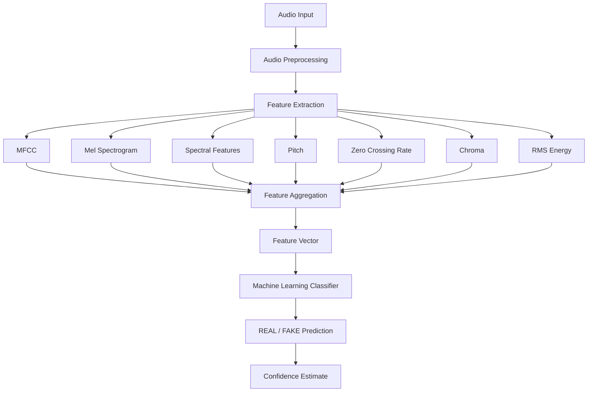
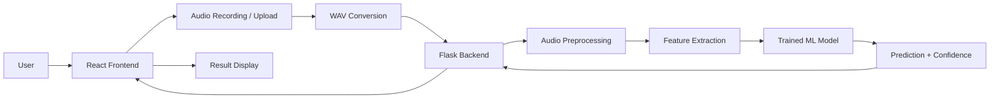
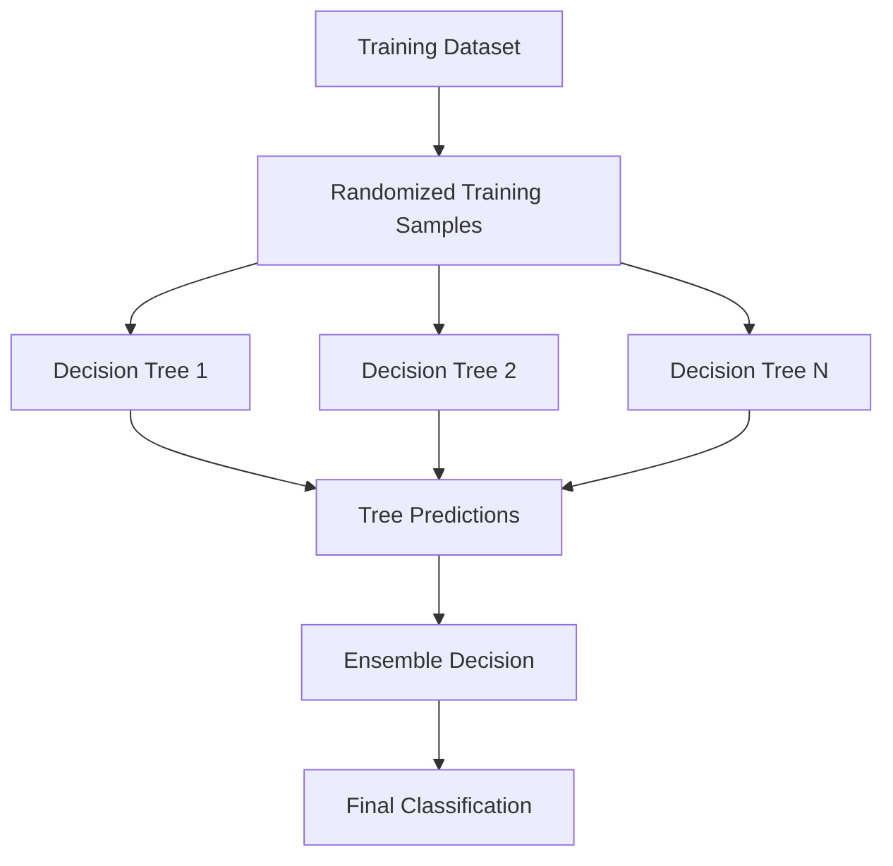
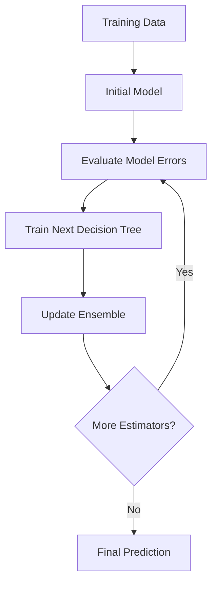
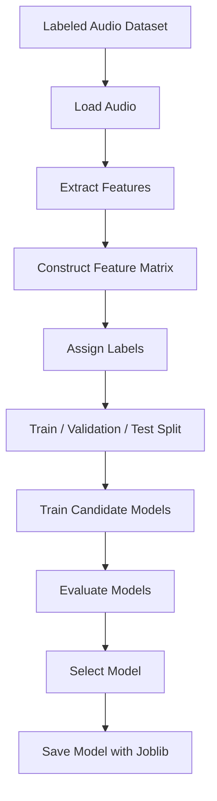
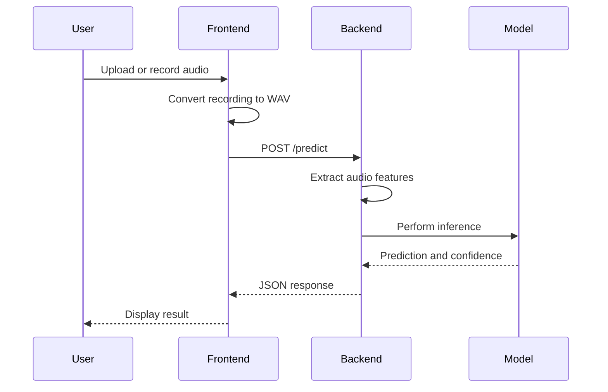

# VoxShield

### AI-Powered Voice Clone Detection for Digital Communication

[](https://www.python.org/)
[](https://scikit-learn.org/)
[](https://flask.palletsprojects.com/)
[](https://react.dev/)
[](LICENSE)

VoxShield is a machine learning-based audio analysis system designed to identify potential synthetic and manipulated speech associated with voice-cloning impersonation attacks.

The system extracts acoustic and spectral features from audio recordings and uses supervised machine learning to classify audio as **REAL** or **FAKE**.

VoxShield focuses on an accessible, demonstration-oriented approach to voice authenticity analysis, with an emphasis on Indian-accented and Indian-speaker audio.

> VoxShield is a research and educational prototype. Its predictions should not be treated as definitive proof of voice authenticity.

---

## Live Demo

**Web Application:**  
[https://voxshield-psi.vercel.app/](https://voxshield-psi.vercel.app/)

The application provides a browser-based interface for submitting audio recordings and receiving model-generated classification results.

The demonstration uses microphone input and uploaded audio. It does not intercept or monitor real telephone calls.

---

## Project Overview

Voice cloning technologies can be misused to impersonate trusted individuals during financial fraud, social engineering, and other communication-based attacks.

Traditional voice-based trust can become unreliable when an attacker uses synthetic or manipulated speech.

VoxShield explores an audio classification approach that analyzes measurable properties of speech recordings and produces a machine learning prediction.

### Project Objectives

- Analyze audio using acoustic and spectral features.
- Develop a supervised machine learning classifier.
- Support uploaded audio and browser microphone recordings.
- Provide a web interface for model inference.
- Explore challenges in synthetic speech detection.
- Evaluate the effect of recording conditions and dataset composition on model performance.

---

## Core Approach

VoxShield uses a classical machine learning pipeline rather than a deep neural network trained directly on raw audio.



The extracted features are converted into a fixed-length numerical representation before being passed to the classifier.

---

## System Architecture



### Application Components

| Component | Technology | Responsibility |
|---|---|---|
| Frontend | React, Vite, Tailwind CSS | User interface and audio submission |
| Audio Processing | Librosa, NumPy | Feature extraction and signal analysis |
| Machine Learning | Scikit-learn | Supervised audio classification |
| Model Persistence | Joblib | Saving and loading trained models |
| Backend | Flask, Flask-CORS | API and inference service |
| Deployment | Vercel, Render | Frontend and backend hosting |

---

## Machine Learning Pipeline

VoxShield converts audio signals into numerical features that can be processed by classical machine learning algorithms.

### Processing Stages

1. Audio input
2. Signal preprocessing
3. Acoustic and spectral feature extraction
4. Feature aggregation
5. Feature vector construction
6. Model inference
7. Classification result

The same feature extraction logic must be maintained across training and inference.

This ensures that the trained model receives input with the expected feature ordering and dimensions.

---

# Machine Learning

## Feature Engineering

The system uses handcrafted audio features to describe different properties of speech signals.

The proposed expanded feature configuration contains 191 features.

The final feature count must match the finalized implementation.

| Feature Group | Description | Proposed Dimensions |
|---|---|---:|
| MFCC | Spectral characteristics related to speech | 80 |
| Mel Spectrogram | Mel-scale spectral energy representation | 80 |
| Spectral Centroid | Frequency distribution center | 2 |
| Spectral Bandwidth | Spectral spread | 2 |
| Spectral Rolloff | Frequency distribution boundary | 2 |
| Spectral Contrast | Differences between spectral peaks and valleys | 7 |
| Pitch | Fundamental frequency statistics | 2 |
| Zero Crossing Rate | Time-domain waveform variation | 2 |
| Chroma | Energy distribution across pitch classes | 12 |
| RMS Energy | Signal magnitude statistics | 2 |
| **Total** | | **191** |

The listed dimensions describe the proposed feature configuration, including statistical aggregation where applicable.

---

## 1. Mel-Frequency Cepstral Coefficients

MFCCs are a commonly used representation of audio spectral characteristics.

They transform spectral information into a compact representation based on the Mel frequency scale.

### Role in VoxShield

MFCCs provide information about the spectral characteristics of speech that may help the classifier distinguish patterns in the training data.

The proposed configuration calculates the mean and standard deviation of 40 coefficients.

```text
40 coefficients × 2 statistics = 80 features
```

### Reference

- [Librosa MFCC Documentation](https://librosa.org/doc/latest/generated/librosa.feature.mfcc.html)

---

## 2. Mel Spectrogram

A Mel Spectrogram represents the distribution of audio energy across Mel-scaled frequency bands over time.

It provides a time-frequency representation of the signal.

### Role in VoxShield

Mel Spectrogram statistics complement MFCC features by representing spectral energy distribution in another form.

The proposed configuration uses 40 Mel bands and aggregates their mean and standard deviation.

```text
40 Mel bands × 2 statistics = 80 features
```

### Reference

- [Librosa Mel Spectrogram Documentation](https://librosa.org/doc/latest/generated/librosa.feature.melspectrogram.html)

---

## 3. Spectral Features

Spectral features describe the distribution of frequency energy within an audio signal.

VoxShield includes:

- Spectral Centroid
- Spectral Bandwidth
- Spectral Rolloff
- Spectral Contrast

These features are used as additional information alongside MFCCs and Mel Spectrograms.

### Purpose

Spectral features may help describe differences in audio characteristics between recordings.

Their effectiveness for synthetic speech detection depends on the dataset, recording conditions, and trained model.

### Reference

- [Librosa Feature Extraction Documentation](https://librosa.org/doc/latest/feature.html)

---

## 4. Pitch

Pitch is associated with the perceived fundamental frequency of a sound.

Speech pitch varies naturally between speakers, languages, emotions, and recording conditions.

### Role in VoxShield

Pitch statistics are included as supplementary acoustic information.

Pitch alone cannot reliably distinguish genuine speech from synthetic speech.

---

## 5. Zero Crossing Rate

Zero Crossing Rate measures how frequently an audio waveform crosses the zero-amplitude axis.

It provides a time-domain description of signal variation.

### Role in VoxShield

ZCR statistics are used as additional signal-level features.

Their contribution should be evaluated experimentally rather than assumed to be specific to voice cloning.

---

## 6. Chroma Features

Chroma features represent the distribution of audio energy across twelve pitch classes.

They are widely used in music information retrieval and harmonic audio analysis.

### Role in VoxShield

Chroma is included in the expanded feature set as supplementary audio information.

Its usefulness for speech authenticity classification requires validation.

---

## 7. RMS Energy

Root Mean Square energy describes the magnitude of an audio signal over time.

### Role in VoxShield

RMS energy statistics provide information about signal amplitude and variation.

These measurements can be influenced by microphone distance, gain, background noise, and recording conditions.

---

# Classification Algorithms

VoxShield uses supervised machine learning for binary audio classification.

The candidate algorithms are:

- Random Forest Classifier
- Gradient Boosting Classifier

The deployed model and final algorithm selection should be determined from the actual implementation and evaluation results.

---

## Random Forest Classifier

Random Forest is an ensemble learning algorithm that combines multiple decision trees.

Each tree learns decision rules from randomized training data and feature subsets. The predictions from the individual trees are combined to produce the final classification.

### Algorithm Workflow



### Why Random Forest?

- Suitable for structured numerical features.
- Can model nonlinear relationships.
- Provides an ensemble-based classification approach.
- Does not generally require feature scaling for tree split decisions.
- Offers feature importance estimates.

### Limitations

Random Forest does not inherently learn robust voice-cloning representations from raw waveforms.

Its performance depends on feature quality, training data, class balance, and recording-domain differences.

### Reference

- [Scikit-learn Random Forest](https://scikit-learn.org/stable/modules/ensemble.html#random-forests)

---

## Gradient Boosting Classifier

Gradient Boosting builds an ensemble of decision trees sequentially.

Each successive stage attempts to improve the existing model by learning from errors associated with the current ensemble.

### Algorithm Workflow



### Why Gradient Boosting?

- Models nonlinear relationships.
- Provides an alternative to Random Forest.
- Can be effective for structured numerical features.
- Allows tuning through learning rate and estimator count.

### Limitations

- Sequential training can increase training time.
- Sensitive to hyperparameter selection.
- Can overfit when model complexity is unsuitable.
- Performance depends on the training dataset and evaluation methodology.

### Reference

- [Scikit-learn Gradient Boosting](https://scikit-learn.org/stable/modules/ensemble.html#gradient-boosting)

---

## Algorithm Comparison

| Characteristic | Random Forest | Gradient Boosting |
|---|---|---|
| Learning Strategy | Ensemble of randomized trees | Sequential additive ensemble |
| Tree Training | Generally independent | Successive stages |
| Nonlinear Relationships | Supported | Supported |
| Feature Scaling | Generally not required | Generally not required |
| Key Parameters | Number of trees, depth, feature selection | Learning rate, number of trees, depth |
| Main Consideration | Ensemble diversity and overfitting | Sequential optimization and overfitting |

The final classifier should be selected using reproducible evaluation results rather than assumptions about algorithm performance.

---

# Model Training

The training pipeline converts labeled audio samples into feature vectors and trains a supervised classifier.



### Training Components

| Component | Responsibility |
|---|---|
| Audio Loader | Reads supported audio files |
| Feature Extractor | Converts audio into numerical features |
| Feature Matrix | Stores extracted features |
| Labels | Identifies real and fake samples |
| Classifier | Learns classification patterns |
| Model Persistence | Stores the trained model for inference |

### Class Balance

Class imbalance can influence classifier behavior.

A model trained on an imbalanced dataset may favor the majority class and produce misleading overall accuracy.

VoxShield therefore considers class distribution and class-wise evaluation when assessing model behavior.

---

# Model Evaluation

Evaluation is required to determine whether the model generalizes beyond the training samples.

### Key Metrics

| Metric | Purpose |
|---|---|
| Accuracy | Overall proportion of correct predictions |
| Precision | Correctness of positive predictions |
| Recall | Coverage of actual positive samples |
| F1 Score | Combined precision and recall measure |
| Confusion Matrix | Distribution of classification outcomes |

The meaning of positive and negative classes depends on the label encoding used by the model.

### Evaluation Considerations

Performance should be assessed with attention to:

- Unseen speakers
- Recording device differences
- Background noise
- Audio compression
- Dataset source
- Class distribution
- Synthetic voice generation methods

A high accuracy on a particular dataset does not establish reliable performance against all real-world voice-cloning attacks.

---

# Confidence Score

VoxShield returns a confidence-related value with the classification result.

For classifiers that expose `predict_proba()`, the output represents a model-derived estimate of class probability.

It should not automatically be interpreted as a calibrated probability of authenticity.

### Example Response

```json
{
  "result": "FAKE",
  "confidence": 0.87
}
```

This is an illustrative response structure.

The meaning, scale, and calibration of the confidence value depend on the final implementation.

---

# Application Architecture

## Frontend

The frontend is built using React, Vite, and Tailwind CSS.

### Responsibilities

- Provide the user interface.
- Support audio upload.
- Capture microphone recordings.
- Convert recorded audio to WAV.
- Submit audio to the backend.
- Display model results.

### Deployment

The frontend is deployed on Vercel.

**Live Application:**  
[https://voxshield-psi.vercel.app/](https://voxshield-psi.vercel.app/)

---

## Backend

The backend is built using Flask and Flask-CORS.

It provides the inference API that receives audio files and returns model predictions.

### API Endpoints

| Method | Endpoint | Purpose |
|---|---|---|
| GET | `/health` | Backend health check |
| POST | `/predict` | Audio classification |

### Inference Workflow



### Deployment

The backend is deployed on Render.

**Backend URL:**  
[https://voxshield-dnck.onrender.com](https://voxshield-dnck.onrender.com)

The service uses a Flask application and serves the trained model for inference.

---

# Dataset

VoxShield uses audio from multiple sources to support the development of its classification pipeline.

### Dataset Categories

- Real speech recordings
- Synthetic speech generated using TTS systems
- Additional manipulated or designated fake audio samples

### Data Sources

The project has explored Indian-speaker audio through the IndieFake Dataset and synthetic speech generated using Microsoft Edge TTS.

Additional speech recordings may be used to increase audio diversity.

### Dataset Considerations

The reliability of a voice-cloning detector depends on the quality and relevance of its training data.

Important considerations include:

- Speaker diversity
- Language and accent coverage
- Recording conditions
- Synthetic speech generation methods
- Class balance
- Speaker overlap between training and testing data

### Data Integrity

Not every manipulated audio sample represents genuine voice cloning.

Reversed, distorted, or otherwise altered recordings may correspond to different detection tasks.

The project distinguishes these limitations when interpreting model performance.

---

# Scope and Limitations

## Current Scope

VoxShield focuses on audio classification for potential synthetic or manipulated speech.

The current prototype supports:

- Audio upload
- Browser microphone recording
- WAV-based backend inference
- Machine learning classification
- Confidence-related output

## Out of Scope

The current hackathon implementation does not provide:

- Direct phone-call interception
- Cellular network monitoring
- WhatsApp or VoIP traffic interception
- Guaranteed prevention of voice-cloning attacks
- Universal detection of all synthetic speech
- A certified authentication mechanism

The live microphone workflow is a demonstration of audio analysis and does not constitute continuous communication-channel monitoring.

---

# Research and Technical References

The following resources support the technical concepts used in VoxShield.

### Audio Processing

- [Librosa Documentation](https://librosa.org/doc/latest/)
- [Librosa Feature Extraction](https://librosa.org/doc/latest/feature.html)

### Machine Learning

- [Scikit-learn Documentation](https://scikit-learn.org/stable/)
- [Random Forest Documentation](https://scikit-learn.org/stable/modules/ensemble.html#random-forests)
- [Gradient Boosting Documentation](https://scikit-learn.org/stable/modules/ensemble.html#gradient-boosting)

### Backend

- [Flask Documentation](https://flask.palletsprojects.com/)
- [Flask-CORS Documentation](https://flask-cors.readthedocs.io/)

### Frontend

- [React Documentation](https://react.dev/)
- [Vite Documentation](https://vite.dev/)
- [Tailwind CSS Documentation](https://tailwindcss.com/docs)

### Research Context

- Abhay Kumar et al. (2025), IndieFake Dataset, IIT Ropar. Refer to the original publication and dataset documentation for the authoritative citation and licensing terms.
- Saxena et al. (2025), *AI Powered Deepfake Voice and Scam Call Detector for Secure Communication*. Refer to the original publication for its methodology and findings.

Research references should be verified against the original publications before being used as formal academic citations.

---

# Documentation

Detailed technical documentation is available in the project Wiki.

| Documentation | Link |
|---|---|
| Wiki Home | [Open Wiki](https://github.com/codepiyusss/VoxShield/wiki) |
| System Architecture | [Architecture](https://github.com/codepiyusss/VoxShield/wiki/System-Architecture) |
| Audio Feature Extraction | [Feature Extraction](https://github.com/codepiyusss/VoxShield/wiki/Audio-Feature-Extraction) |
| Feature Vector Construction | [Feature Vector Construction](https://github.com/codepiyusss/VoxShield/wiki/Feature-Vector-Construction) |
| Machine Learning Algorithms | [ML Algorithms](https://github.com/codepiyusss/VoxShield/wiki/Machine-Learning-Algorithms) |
| Model Training | [Model Training](https://github.com/codepiyusss/VoxShield/wiki/Model-Training) |
| Model Evaluation | [Model Evaluation](https://github.com/codepiyusss/VoxShield/wiki/Model-Evaluation) |
| Confidence Score | [Confidence Score](https://github.com/codepiyusss/VoxShield/wiki/Confidence-Score) |
| Real-Time Detection | [Real-Time Detection](https://github.com/codepiyusss/VoxShield/wiki/Real-Time-Detection) |

---

# Future Research Directions

Potential improvements include:

- More diverse Indian-language speech data
- Speaker-independent evaluation
- Robustness testing with background noise
- Evaluation against additional voice-generation systems
- Audio augmentation
- Probability calibration
- Temporal feature analysis
- Deep learning-based audio representations
- Continuous streaming inference

These directions are not part of the current deployed scope.

---

# Responsible Use

VoxShield is intended for research, experimentation, and educational demonstration.

The system should not be used as the sole basis for financial authorization, identity verification, emergency decisions, or other high-impact security decisions.

A model prediction is not definitive evidence that a speaker is genuine or synthetic.

Audio data should be collected, processed, and stored in accordance with applicable privacy requirements and dataset licenses.

---

# License

This project is licensed under the MIT License.

See the [LICENSE](LICENSE) file for details.

---

## Project

**VoxShield**  
AI-Powered Voice Clone Detection

[Live Demo](https://voxshield-psi.vercel.app/) · [GitHub Repository](https://github.com/codepiyusss/VoxShield) · [Documentation Wiki](https://github.com/codepiyusss/VoxShield/wiki)
